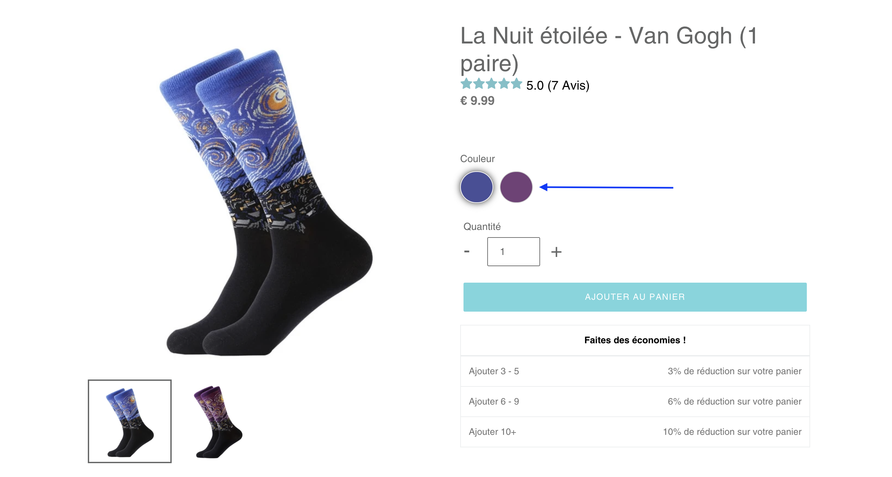

# shopify-debut-swatch

I did that repository because there is only poor and outaded documentation about that subject.
The purpose of that repo is to help anybody to add `swatch` for color, size, etc... to his own `debut` theme on Shopify.

Here are the steps I did to be able to have the `swatch` working properly.

### Step 1: Create a new snippet

- Go to Shopify
- Click `Online store`
- On your current theme click on `Actions`
- Click on `Edit code`

> Here you are in the edit code section and you have access to all the code available for your theme.

- On the left side search for `Snippets`
- Click on `Add a new snippet`
- Write `swatch`
- Press `Enter`

> Once you've done that, you can edit that file and past the code below.

```liquid

<div class="swatch error">
  <p>You must include the snippet swatch.liquid with the name of a product option.</p> 
  <p>Use: <code></code></p>
  <p>Example: <code></code></p>
</div>







  
    
    
    <style>
      label[for="product-select-option-{{ option_index }}"] { display: none; }
      #product-select-option-{{ option_index }} { display: none; }
      #product-select-option-{{ option_index }} + .custom-style-select-box { display: none !important; }
    </style>
    <script>$(window).load(function() { $('.selector-wrapper:eq({{ option_index }})').hide(); });</script>
    
    
      
    
  



<div class="swatch error">
  <p>You included the snippet swatch.liquid with the name of a product option — <code>'{{ swatch }}'</code> — that does not belong to your product.</p>
  <p>Use <code></code></p>
  <p>Example: <code></code></p>
  <p><strong>This is case-sensitive!</strong> Do not put in <code>'color'</code> if your product option name is <code>'Color'</code>.</p>
</div>

<div class="swatch clearfix" data-option-index="{{ option_index | plus: 1 }}">
  <div class="header">{{ swatch }}</div>
  
  
    
    
      
       
      
      <div data-value="{{ value | escape }}" class="swatch-element color {{ value | handle }} availablesoldout">
        <input class="single-option-selector-{{ section.id }}" data-index="option{{ option_index | plus: 1 }}" id="swatch-{{ option_index }}-{{ value | handle }}" type="radio" name="option-{{ option_index }}" value="{{ value | escape }}" checked disabled />
        
        <label for="swatch-{{ option_index }}-{{ value | handle }}" style="background-color: {{ value | split: ' - ' | last }};">
          <div class="crossed-out"></div>
        </label>
        
        <label for="swatch-{{ option_index }}-{{ value | handle }}">
          {{ value }}
          <div class="crossed-out"></div>
        </label>
        
      </div>
    
    
    <script>
      jQuery('.swatch[data-option-index="{{ option_index | plus: 1 }}"] .{{ value | handle }}').removeClass('soldout').addClass('available').find(':radio').removeAttr('disabled');
    </script>
    
  
</div>




```

> I have updated all the code needed to have a `swatch` working nicely.

### Step 2: Update the style

> Once the snippet has been created you will have to set up the appropriate style (of course, you can update it accordingly to your needs).

- On the left side search for `Assets`
- Click on `Add a new asset`
- Write `custom`
- Select `css.liquid`
- Press `Enter`

> Once you've done that, you can edit that file and past the code below.

```css
/* SWATCH */



.swatch { 
  margin:1em 0; 
}
/* Label */
.swatch .header {
  margin: 0.5em 0;
}
/* Hide radio buttons.*/
.swatch input { 
  display:none;
}
.swatch label {
  /* Rounded corners */
  -webkit-border-radius:50px;
  -moz-border-radius:50px;
  border-radius:50px;
  /* To give width and height */
  float:left;
  /* Color swatches contain no text so they need to have a width. */
  min-width:{{ width }} !important; 
  height:{{ height }} !important;
  /* No extra spacing between them */
  margin:0;
  /* The border when the button is not selected */
  border:#ccc 1px solid;
  /* Background color */
  background-color:#ddd;
  /* Styling text */
  font-size:13px;
  text-align:center;
  line-height:{{ height }};
  white-space:nowrap;
  text-transform:uppercase;
}
.swatch-element label { 
  padding:0 10px; 
  width: 3rem !important;
  height: 3rem !important; 
}
.color .swatch-element label { 
  padding:0; 
}
/* Styling selected swatch */
/* Slightly raised */
.swatch input[type='radio']:checked + label {
  -webkit-box-shadow: 0px 0px 10px rgba(0,0,0,0.8);
  -moz-box-shadow: 0px 0px 10px rgba(0,0,0,0.8);
  box-shadow: 0px 0px 10px rgba(0,0,0,0.8);
  border-color: #fff;
} 
.swatch .swatch-element {
  float:left;
  -webkit-transform:translateZ(0); /* webkit flicker fix */
  -webkit-font-smoothing:antialiased; /* webkit text rendering fix */
  /* Spacing between buttons */
  margin:0px 10px 10px 0;
  /* To position the sold out graphic and tooltip */
  position:relative;
}
/* Image with the cross in it */
.crossed-out { position:absolute; width:100%; height:100%; left:0; top:0; }
.swatch .swatch-element .crossed-out { display:none; }
.swatch .swatch-element.soldout .crossed-out { display:block; }
.swatch .swatch-element.soldout label {
  filter: alpha(opacity=60); /* internet explorer */
  -khtml-opacity: 0.6;      /* khtml, old safari */
  -moz-opacity: 0.6;       /* mozilla, netscape */
  opacity: 0.6;           /* fx, safari, opera */
}
/* Tooltips */
.swatch .tooltip {
  text-align:center;
  background:gray;
  color:#fff;
  bottom:100%;
  padding: 10px;
  display:block;
  position:absolute;
  width:100px;
  left:{{ width | remove: 'px' | to_number | divided_by: 2 | minus: 50 | plus: 2 }}px;
  margin-bottom:15px;
  /* Make it invisible by default */
  filter:alpha(opacity=0);
  -khtml-opacity: 0;
  -moz-opacity: 0;
  opacity:0;
  visibility:hidden;
  /* Animations */
  -webkit-transform: translateY(10px);
     -moz-transform: translateY(10px);
      -ms-transform: translateY(10px);
       -o-transform: translateY(10px);
          transform: translateY(10px);
  -webkit-transition: all .25s ease-out;
     -moz-transition: all .25s ease-out;
      -ms-transition: all .25s ease-out;
       -o-transition: all .25s ease-out;
          transition: all .25s ease-out;
  -webkit-box-shadow: 2px 2px 6px rgba(0, 0, 0, 0.28);
     -moz-box-shadow: 2px 2px 6px rgba(0, 0, 0, 0.28);
      -ms-box-shadow: 2px 2px 6px rgba(0, 0, 0, 0.28);
       -o-box-shadow: 2px 2px 6px rgba(0, 0, 0, 0.28);
          box-shadow: 2px 2px 6px rgba(0, 0, 0, 0.28);
  z-index: 10000;
  -moz-box-sizing:border-box; 
  -webkit-box-sizing:border-box; 
  box-sizing:border-box;
}
.swatch .tooltip:before {
  bottom:-20px;
  content:" ";
  display:block;
  height:20px;
  left:0;
  position:absolute;
  width:100%;
}
/* CSS triangle */
.swatch .tooltip:after {
  border-left:solid transparent 10px;
  border-right:solid transparent 10px;
  border-top:solid gray 10px;
  bottom:-10px;
  content:" ";
  height:0;
  left:50%;
  margin-left:-13px;
  position:absolute;
  width:0;
}
.swatch .swatch-element:hover .tooltip {
  filter:alpha(opacity=100);
  -khtml-opacity:1;
  -moz-opacity:1;
  opacity:1;
  visibility:visible;
  -webkit-transform:translateY(0px);
     -moz-transform:translateY(0px);
      -ms-transform:translateY(0px);
       -o-transform:translateY(0px);
          transform:translateY(0px);
}
.swatch.error {
  background-color:#E8D2D2!important;
  color:#333!important;
  padding:1em;
  border-radius:5px;
}
.swatch.error p {
  margin:0.7em 0;
}
.swatch.error p:first-child {
  margin-top:0;
}
.swatch.error p:last-child {
  margin-bottom:0;
}
.swatch.error code {
  font-family:monospace;
}
```

- On the left side search for `theme.liquid`
- Search for `href="{{ 'theme.css' | asset_url }}"`
- Add the link to the stylesheet `<link rel="stylesheet" href="{{ 'custom.css' | asset_url }}" type="text/css" media="print" onload="this.media='all';">`

### Step 3: Update product-template.liquid

Now that you have your snippet and the style, you can update the product-template to add the `swatch` element.

- On the left side search for `product-template.liquid`
- Search in the document for `unless product.has_only_default_variant`

> Now you can paste the code below to replace the block that you found.

```liquid

  <div class="product-form__controls-group">
    
      
        <div class="selector-wrapper js product-form__item">
            <label for="SingleOptionSelector-{{ forloop.index0 }}">
              {{ option.name }}
            </label>
            <select class="single-option-selector single-option-selector-{{ section.id }} product-form__input"
                    id="SingleOptionSelector-{{ forloop.index0 }}"
                    data-index="option{{ forloop.index }}"
                    >
              
              <option value="{{ value | escape }}" selected="selected">{{ value }}</option>
              
            </select>
        </div>
       
       <!-- SWATCHES: uncomment the code above to rollback and remove the code below -->
         
         <!-- END SWATCHES -->
      
    
  </div>

```

### Step 4: Edit the theme.js

> In order that in your cart-popup the colors are display correctly follow the next steps.

- On the left side search for `theme.js`
- Search in the document for `_getVariantOptionList: function(variantOptions)`
- Replace `variantOption.value` with `variantOption.value.split(' - ')[0]`

### Step 4: Edit the theme.js

> In order that in your cart the colors are display correctly follow the next steps.

- On the left side search for `cart-template.liquid`
- Search in the document for `product-details__item product-details__item--variant-option`
- Replace `{{ option.value }}` with `{{ option.value | split: ' - ' | first | handle }}`

### Step 5: update your products

- Go to products
- Edit a product which contains color variant
- Edit the color variant such has `{{Text shown to the customer}} - {{your color as string or hex (red or #f00}}`

## Conclusion

Now you should be able to see the `swatch` element on your product page such as the image below


